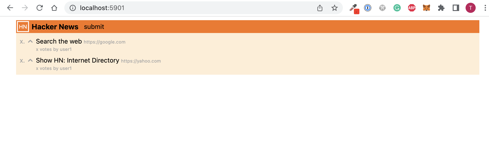

# HackerNews Clone

In this guide, we'll build a [Hacker News](https://news.ycombinator.com/) clone using Go server-side templates and [Tailwind](https://tailwindcss.com/) for styling.&#x20;

### Prerequisites

* [Go 1.16+](https://go.dev/doc/install)
* [Node v16+](https://nodejs.org/en/download/)
* [Copper CLI](https://docs.gocopper.dev/getting-started/installation)

### Setup Project

Open up your terminal and create a new project:

```
copper create -frontend=go:tailwind github.com/<your-username>/hackernews
```

Now, start the app server:

```
cd hackernews && copper run -watch
```

And in a separate terminal window, start the Tailwind server:

```
cd hackernews/web && npm run dev
```

Open [http://localhost:5901](http://localhost:5901/) to see the Copper welcome page.

### Layout Files

Let's edit the `web/src/layouts/main.html` file and make it look more like Hacker News:

```html
<!DOCTYPE html>
<html lang="en">
  <head>
    <meta charset="UTF-8" />
    <meta name="viewport" content="width=device-width, initial-scale=1.0" />

    <title>Hacker News Clone</title>

    <link rel="stylesheet" href="/static/styles.css" />
  </head>
  <body>
    <div class="p-2 max-w-5xl mx-auto">
      <div class="bg-orange-500 flex space-x-1">
        <a href="/" class="block border-2 border-white text-xs text-white p-0.5 m-0.5">
          HN
        </a>
        <div class="flex space-x-3 items-center">
          <div class="font-bold">
            {{ template "title" . }}
          </div>
          <div class="text-sm">
            {{ template "links" . }}
          </div>
        </div>
      </div>
      <div class="bg-orange-100 p-2">
        {{ template "content" . }}
      </div>
    </div>
  </body>
</html>

```

This layout requires each page to define the `title`, `links`, and `content` template. So, let's edit `web/src/pages/index.html` and define those template blocks:

```go
{{ define "title" }}
Hacker News
{{ end }}

{{ define "links" }}
<a href="/submit">submit</a>
{{ end }}

{{ define "content" }}

{{ end }}
```

### The Submit Page

Hacker News requires users to make submissions. Let's create a new Submit page with a simple form that can accept these submissions.

Run this command to create a new `/submit` route:

```
copper scaffold:route -handler=HandleSubmitPage -path=/submit app
```

Open `pkg/app/router.go` and edit the newly created `HandleSubmitPage` function to render the `submit.html` page:

```go
func (ro *Router) HandleSubmitPage(w http.ResponseWriter, r *http.Request) {
  ro.rw.WriteHTML(w, r, chttp.WriteHTMLParams{
    PageTemplate: "submit.html",
  })
}
```

Create a new file `web/src/pages/submit.html` with the following markup:

```html
{{ define "title" }}
Submit
{{ end }}

{{ define "links" }}
{{ end }}

{{ define "content" }}
<form method="post" action="/submit">
    <table class="text-sm table-fixed">
        <tr>
            <td class="py-1">
                <label for="title" class="text-neutral-500">title</label>
            </td>
            <td>
                <input id="title" name="title" type="text" class="border border-black w-64 px-1" />
            </td>
        </tr>
        <tr>
            <td class="py-1">
                <label for="url" class="text-neutral-500">url</label>
            </td>
            <td>
                <input id="url" name="url" type="text" class="border border-black w-64 px-1" />
            </td>
        </tr>
        <tr>
            <td class="py-1"></td>
            <td>
                <button type="submit" class="bg-gray-100 border border-black text-sm px-2">
                    submit
                </button>
            </td>
        </tr>
    </table>
</form>
{{ end }}
```

Notice that the markup includes an HTML form that makes a `POST` request to the `/submit` endpoint with `title` and `url`as the form values.

Open [http://localhost:5901/submit](http://localhost:5901/submit) in your browser and play around with the page. For now, hitting submit won't work because we don't have a route handler for submissions.

### Save Posts

Let's set up a storage layer that can save user submissions into our database. We'll keep this logic in a new package called `posts`:

```
copper scaffold:pkg posts
copper scaffold:queries posts
```

The above commands create the `pkg/posts` package as well as a `pkg/posts/queries.go` that we can use to implement our SQL queries.

Before we make any SQL queries, let's create the `Post` model and its database migration:

Open up `pkg/posts/models.go` and define the `Post` model:

```go
type Post struct {
	ID     string
	Title  string
	URL    string
	Poster string
}
```

Then, open up `migrations/0001_initial.sql` and define its database schema:

```sql
-- +migrate Up
create table if not exists posts
(
    id     text     primary key,
    title  text,
    url    text,
    poster text
);

-- +migrate Down
drop table posts;

```

In your terminal, run `copper migrate` to create the table.

Now that we have a `Post` model and a `posts` table in our database, we can write queries in the `pkg/posts/queries.go` file. Add the following `SavePost` method that can be used to insert a new entry into the `posts` table:

```go
func (q *Queries) SavePost(ctx context.Context, post *Post) error {
	const query = "INSERT INTO posts (id, title, url, poster) values (?, ?, ?, ?)"

	_, err := q.querier.Exec(ctx, query,
		post.ID,
		post.Title,
		post.URL,
		post.Poster,
	)
	return err
}
```

Now, let's head over to `pkg/app/router.go` and use the `SavePost` method to handle form submissions.

Wire `*posts.Queries` dependency on the `Router`:

```go
type NewRouterParams struct {
	Posts  *posts.Queries
	...
}

func NewRouter(p NewRouterParams) *Router {
	return &Router{
		posts:  p.Posts,
		...
	}
}

type Router struct {
	posts  *posts.Queries
	...
}
```

Create a new route handler to handle user submissions. In your terminal, run this command:

```
copper scaffold:route -handler=HandleSubmitPost -method=Post -path=/submit app
```

Back in your `pkg/app/router.go`file, implement the `HandleSubmitPost` method like so:

```go
func (ro *Router) HandleSubmitPost(w http.ResponseWriter, r *http.Request) {
	var (
		title = strings.TrimSpace(r.PostFormValue("title"))
		url   = strings.TrimSpace(r.PostFormValue("url"))
	)

	if title == "" || url == "" {
		ro.rw.WriteHTMLError(w, r, cerrors.New(nil, "invalid post", map[string]interface{}{
			"form": r.Form,
		}))
		return
	}

	err := ro.posts.SavePost(r.Context(), &posts.Post{
		ID:     uuid.New().String(), // Import "github.com/google/uuid
		Title:  title,
		URL:    url,
		Poster: "user1",
	})
	if err != nil {
		ro.rw.WriteHTMLError(w, r, cerrors.New(err, "failed to save post", map[string]interface{}{
			"form": r.Form,
		}))
		return
	}

	http.Redirect(w, r, "/", http.StatusSeeOther)
}
```

Now, your submit page should work! Click submit will make a new entry into the `posts` table.

### The Home Page

On the home page, we want to show a list of all posts that exist in the database. Let's start with creating a new SQL query and work our way up from there. In `pkg/posts/queries.go`, add the following method to list all posts:

```go
func (q *Queries) ListPosts(ctx context.Context) ([]Post, error) {
	const query = "SELECT id, title, url, poster FROM posts"

	var (
		posts []Post
		err   = q.querier.Select(ctx, &posts, query)
	)

	return posts, err
}
```

Edit the `HandleIndexPage` method in `pkg/app/router.go` to query all posts and pass it to the HTML template:

```go
func (ro *Router) HandleIndexPage(w http.ResponseWriter, r *http.Request) {
	allPosts, err := ro.posts.ListPosts(r.Context())
	if err != nil {
		ro.rw.WriteHTMLError(w, r, cerrors.New(err, "failed to list posts", nil))
		return
	}

	ro.rw.WriteHTML(w, r, chttp.WriteHTMLParams{
		PageTemplate: "index.html",
		Data: map[string][]posts.Post{
			"Posts": allPosts,
		},
	})
}
```

Now, edit `web/src/pages/index.html` to make use of the data and render the posts:

```markup
{{ define "content" }}

<div class="flex-col space-y-2">
    {{ range .Posts }}
        <div class="flex space-x-0.5 text-sm text-neutral-400">
            <div>x.</div>
            <div>
                <form method="post" action="/posts/{{ .ID }}/vote">
                    <button type="submit" class="cursor">
                        <svg xmlns="http://www.w3.org/2000/svg" class="h-5 w-5" viewBox="0 0 20 20" fill="currentColor">
                            <path fill-rule="evenodd" d="M14.707 12.707a1 1 0 01-1.414 0L10 9.414l-3.293 3.293a1 1 0 01-1.414-1.414l4-4a1 1 0 011.414 0l4 4a1 1 0 010 1.414z" clip-rule="evenodd" />
                        </svg>
                    </button>
                </form>
            </div>
            <div>
                <div>
                        <span class="text-black">
                            <a href="{{ .URL }}" target="_blank">{{ .Title }}</a>
                        </span>
                    <span class="text-[10px]">{{ .URL }}</span>
                </div>
                <div class="leading-3 text-[10px]">x votes  by {{ .Poster }}</div>
            </div>
        </div>
    {{ end }}
</div>

{{ end }}
```

Once you make a few submissions, you should see a page similar to this:



### Next Steps

The voting and ranking is an exercise left to the reader. Both of these features use similar patterns to what was used in this guide.

If you need help, head over to [https://github.com/gocopper/examples/tree/main/hackernews](https://github.com/gocopper/examples/tree/main/hackernews) to see a working example.
